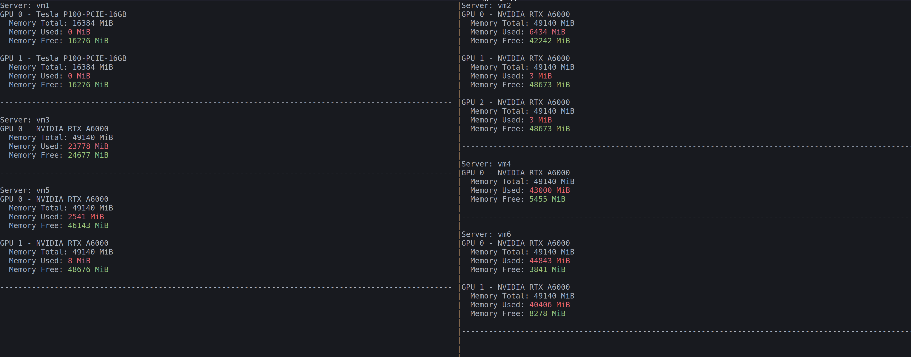

This is a revised version from: https://github.com/mseitzer/gpu-monitor
to display used / free GPUs on multiple different servers


# Usage

now just need to run `./gpu-monitor.py`

# Demo



# Remote GPU Monitor

This Python script allows to check for free Nvidia GPUs in remote servers.
Additional features include to list the type of GPUs and who's using them.
The idea is to speed up the work of finding a free GPU in institutions that share multiple GPU servers.

The script works by using your account to SSH into the servers and running `nvidia-smi`. 

## Features

- Show all free GPUs across servers
- Show all current users of all GPUs (-l or --list)
- Show all GPUs used by yourself (-m or --me)
- Resolve usernames to real names (-f or --finger)

## Requirements

- python3
- SSH access to some Linux servers with Nvidia GPUs
- If the server you connect to uses a different user name than your local name, you either have to specify your name on the servers using the `-s` option, or set up access as described in [setup for convenience](#setup-for-convenience).

## Usage

For checking for free GPUs on some server(s), simply add their address(es) after the script name.
You might need to enter your password. To avoid that, follow the steps in [setup for convenience](#setup-for-convenience).

```
> ./gpu_monitor.py myserver.com

Server myserver.com:
        GPU 5, Tesla K80
        GPU 7, Tesla K80
```

If you have some set of servers that you regularily check, specify them in the file `servers.txt`, one address per line.
Once you did that, running just `./gpu_monitor.py` checks all servers specified in this file by default.

If you want to list all GPUs and who currently uses them, you can use the `-l` flag:
```
> ./gpu_monitor.py -l myserver.com

Server myserver.com:
        GPU 0 (Tesla K80): Used by userA
        GPU 1 (Tesla K80): Used by userB
        GPU 2 (Tesla K80): Used by userA
        GPU 3 (Tesla K80): Used by userC
        GPU 4 (Tesla K80): Used by userC
        GPU 5 (Tesla K80): Free
        GPU 6 (Tesla K80): Used by userD
        GPU 7 (Tesla K80): Free
```

If you just want to see the GPUs used by yourself, you can use the `--me` flag.
This requires that your user name is the same as remotely, or that you specify the name using the `-s` flag.
```
> ./gpu_monitor.py --me myserver.com
Server myserver.com:
        GPU 3 (Tesla K80): Used by userC
```

Finally, if you also want to see the real names of users, you can use the `-f` flag.
This uses Linux's `finger` command.
```
> ./gpu_monitor.py -f myserver.com

Server myserver.com:
        GPU 0 (Tesla K80): Used by userA (Sue Parsons)
        GPU 1 (Tesla K80): Used by userB (Tim MacDonald)
        GPU 2 (Tesla K80): Used by userA (Sue Parsons)
        GPU 3 (Tesla K80): Used by userC (Neil Piper)
        GPU 4 (Tesla K80): Used by userC (Neil Piper)
        GPU 5 (Tesla K80): Free
        GPU 6 (Tesla K80): Used by userD (Brandon Ross)
        GPU 7 (Tesla K80): Free
```

## Setup for Convenience

### Setting up an SSH key
If you want to avoid having to enter your password all the time, you can setup an SSH key to login into your server.
If you did this already, you are fine.

1. Open a terminal and run `cd .ssh`
2. Run `ssh-keygen` and follow the instructions.
It might be a good idea to not use the default file but to specify a specific filename reflecting the servers you are connecting to.
3. Run `ssh-copy-id <user>@<server>`, where `<user>@<server>` is the server you want to connect. If you chose a different filename for your key, you need to pass the filename with the `-i` option.
4. Repeat step 3 for every server you want to connect to (not necessary if you have a shared home directory on all the servers).
5. Try to connect to the server using `ssh <user>@<server>`.
The first time you connect, it should ask you for the password of the SSH key.
If you are asked for the password multiple times, you might need to manually activate your SSH key using `ssh-add <path_to_ssh_key>`.
If it still does not work, follow with the next steps.

### If you have a different user name on your local machine

This will show you how to avoid having to give your user name if you use the script (and SSH).

1. Go to the folder `.ssh` in your home and open the file `config`.
If it is not there, create it.
2. Add something like this:
```
Host myserver.com
User myusername
```
If you are connecting to multiple servers under the same domain, you can also use `Host *.mydomain.com` to indicate that you are using the same user name for all of them.
3. If you have an SSH key with a different name, you also add the line `IdentityFile path_to_ssh_key` after the `User` line.

